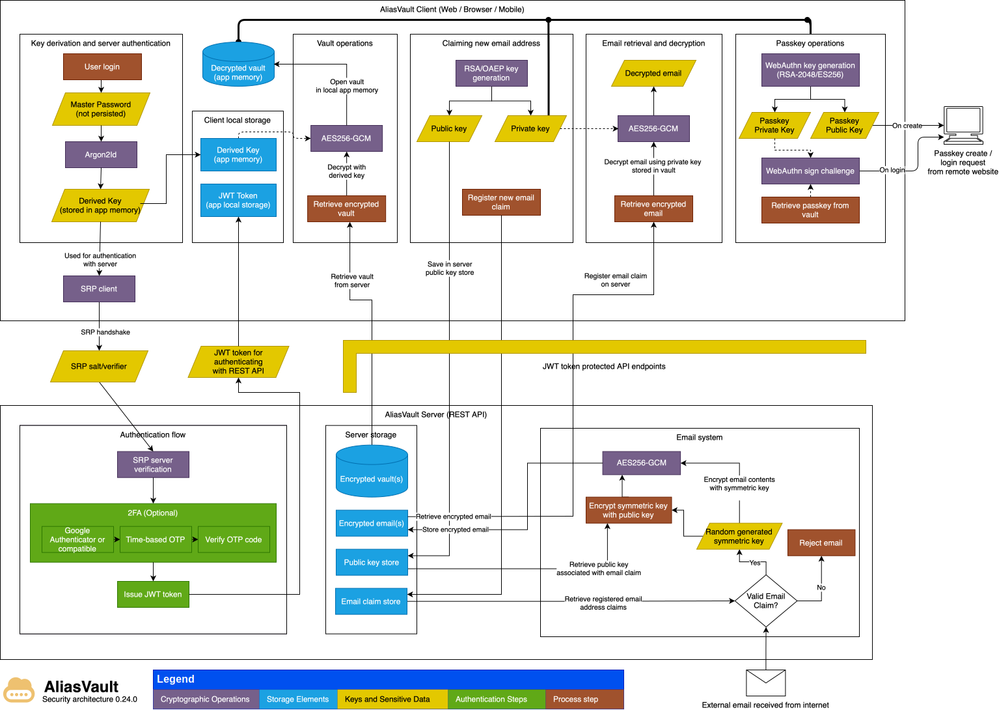

# Architecture
{: .no_toc }

---

AliasVault implements zero-knowledge encryption where sensitive user data never leaves the client device in unencrypted form. Below is a detailed explanation of how the system secures user data and communications.

**What is Zero-Knowledge in AliasVault**:
- **Vault Data** (usernames, passwords, notes, passkeys etc.) is fully encrypted client-side before being sent to the server. The server cannot decrypt any vault contents.
- **Email Contents**: When emails are received by the server, their contents are immediately encrypted with your public key before being saved. Only you can decrypt and read them with your private key.

## Diagram
The security architecture diagram below illustrates all encryption and authentication processes used in AliasVault to secure user data and communications.

<picture>
  <source media="(prefers-color-scheme: dark)" srcset="../assets/diagrams/security-architecture/aliasvault-security-architecture-dark.svg">
  <source media="(prefers-color-scheme: light)" srcset="../assets/diagrams/security-architecture/aliasvault-security-architecture-light.svg">
  
</picture>

You can also view the diagram in a browser-friendly HTML format: [AliasVault Security Architecture](https://docs.aliasvault.net/assets/diagrams/security-architecture/aliasvault-security-architecture.html)

  

    Table of contents
  

  {: .text-delta }
- TOC
{:toc}

## Key Components and Process Flow

### 1. Key Derivation
- When a user enters their master password, it remains strictly on the client device
- The master password is processed through Argon2id (a memory-hard key derivation function) locally
- The derived key serves two purposes:
    - Authentication with the server through the SRP protocol
    - Local encryption/decryption of vault contents using AES-256-GCM

### 2. Authentication Process
1. SRP (Secure Remote Password) Authentication
    - Enables secure password-based authentication without transmitting the password
    - Client and server perform a cryptographic handshake to verify identity

2. Two-Factor Authentication (Optional)
    - If enabled, requires an additional verification step after successful SRP authentication
    - Uses Time-based One-Time Password (TOTP) protocol
    - Compatible with standard authenticator apps (e.g., Google Authenticator)
    - Server only issues the final JWT access token after successful 2FA verification

### 3. Vault Operations
- All vault contents are encrypted/decrypted locally using AES-256-GCM
- The encryption key is derived from the user's master password
- Only encrypted data is ever transmitted to or stored on the server
- The server never has access to the unencrypted vault contents

### 4. Email System Security

#### Key Generation and Storage
1. RSA key pair is generated locally on the client
2. Private key is stored in the encrypted vault
3. Public key is sent to the server and associated with email claim(s)

#### Email Reception Process
1. When an email is received, the server:
    - Verifies if the recipient (email address) matches a valid email claim
    - If no valid claim exists, the email is rejected
    - If valid, generates a random 256-bit symmetric key
    - Encrypts the email content using this symmetric key
    - Encrypts the symmetric key using the recipient's public key
    - Stores both the encrypted email and encrypted symmetric key

#### Email Retrieval Process
1. Client retrieves encrypted email and encrypted symmetric key from server
2. Client uses private key from vault to decrypt the symmetric key
3. Client uses decrypted symmetric key to decrypt the email contents
4. All decryption occurs locally on the client device

> Note: The use of a symmetric key for email content encryption and asymmetric encryption for the symmetric key (hybrid encryption) is implemented due to RSA's limitations on encryption string length and for better performance.

### 5. Passkey Authentication

AliasVault includes a virtual passkey authenticator that implements the WebAuthn Level 2 specification, allowing users to securely store and use passkeys for passwordless authentication across websites and services.

#### Virtual Authenticator Implementation
1. Platform Support
    - Browser Extension: Virtual authenticator using Web Crypto API
    - iOS: Native Swift implementation using CryptoKit
    - Android: Native Kotlin implementation using AndroidKeyStore
    - All platforms provide consistent WebAuthn Level 2 compliant behavior

2. Key Management
    - ES256 (ECDSA P-256) key pairs generated locally on client device
    - Private keys stored as encrypted entries in the user's vault
    - Public keys used for WebAuthn authentication with relying parties
    - All key material encrypted using the same AES-256-GCM vault encryption

#### Passkey Registration Process
1. When registering a new passkey:
    - Client generates an ES256 (ECDSA P-256) key pair locally
    - Private key is encrypted and stored in the user's vault
    - Public key is sent to the relying party (website/service)
    - Attestation object created with proper WebAuthn flags:
        - UP (User Present) - User interaction confirmed
        - AT (Attested Credential Data) - New credential created
        - UV (User Verified) - Optional, based on user verification requirement
        - BE (Backup Eligible) - Credential can be backed up
        - BS (Backup State) - Credential is backed up in vault

2. Authenticator Data
    - Uses AliasVault's unique AAGUID (Authenticator Attestation GUID): `a11a5faa-9f32-4b8c-8c5d-2f7d13e8c942`
    - Sign count always 0 for syncable credentials
    - Supports both "none" and "packed" self-attestation formats
    - CBOR/COSE encoding for attestation objects

#### Passkey Authentication Process
1. When authenticating with an existing passkey:
    - Client retrieves encrypted passkey from vault
    - Private key decrypted locally using vault encryption key
    - Client signs authentication challenge using private key
    - Signature sent to relying party for verification
    - All cryptographic operations performed client-side

2. Cross-Platform Synchronization
    - Passkeys automatically sync across all user devices
    - Encrypted passkey data synchronized through vault sync mechanism
    - Enables seamless authentication on browser extension, iOS app, and Android app
    - Maintains zero-knowledge architecture during sync

#### Additional Capabilities
1. PRF Extension (hmac-secret)
    - Supports WebAuthn PRF extension for deriving additional secrets
    - Enables relying parties to use passkeys for encryption key derivation
    - PRF secrets stored encrypted in vault alongside passkey data
    - Implements HMAC-SHA256 for PRF evaluation
    - PRF is supported via browser extension and iOS (0.24.0+)
        - Android support is pending due to limited Android API support

### 6. Login with Mobile

AliasVault includes a secure "Login with Mobile" feature that allows users to unlock their vault on web browsers or browser extensions by scanning a QR code with their mobile app. This system provides a convenient authentication method while maintaining zero-knowledge security through end-to-end encryption.

#### Security Architecture

The mobile login system uses a hybrid encryption approach combining RSA asymmetric encryption and AES-256-GCM symmetric encryption to ensure that:
- The server never has access to the user's decryption key in plaintext
- Only the authorized client that initiated the request can decrypt the transmitted data
- No sensitive data persists on the server after retrieval

#### Authentication Flow

1. **Initiation (Browser/Extension Client)**
   - Client generates an RSA-2048 key pair locally
   - Public key is sent to the server
   - Server creates a unique request ID and stores the public key
   - Client generates a QR code containing the request ID
   - Private key is kept only in memory (never persisted to disk)

2. **QR Code Scanning (Mobile App)**
   - User scans the QR code with their authenticated mobile app
   - Mobile app retrieves the public key from server
   - Mobile app encrypts the user's vault decryption key using the RSA public key
   - Encrypted decryption key is sent to server
   - Server stores the encrypted decryption key and marks the request as fulfilled

3. **Polling and Retrieval (Browser/Extension Client)**
   - Client polls the server every few seconds
   - Polling continues for up to 2 minutes (3-minute server-side timeout for buffer)
   - When fulfilled, server:
     - Generates a fresh JWT access token and refresh token for the user
     - Creates a random 256-bit AES symmetric key
     - Encrypts the JWT tokens and username using this symmetric key
     - Encrypts the symmetric key itself using the client's RSA public key
     - Returns all encrypted data in the response
     - Immediately marks the request as retrieved and clears sensitive data from database

4. **Decryption (Browser/Extension Client)**
   - Client uses its RSA private key to decrypt the symmetric key
   - Client uses the symmetric key to decrypt the JWT tokens and username
   - Client uses the RSA private key to decrypt the vault decryption key
   - Client can now unlock the vault using the decryption key and stores it in memory
   - RSA private key is immediately purged from memory

#### Security Properties

- **Zero-Knowledge**: The server never has access to the vault decryption key in plaintext. It only temporarily stores the RSA-encrypted version.
- **One-Time Use**: Once a mobile login request is retrieved by the client, it cannot be accessed again. The encrypted data is immediately cleared from the database.
- **Automatic Expiration**: Fulfilled but unretrieved requests are automatically deleted by the server within 24 hours to prevent stale data accumulation.
- **Man-in-the-Middle Protection**: The encryption scheme ensures that any eavesdroppers cannot intercept the decryption key. Only the local client that started the mobile login request has the private key for decryption.
- **Short-Lived Requests**: The 3-minute timeout window limits the attack surface for QR code interception.
